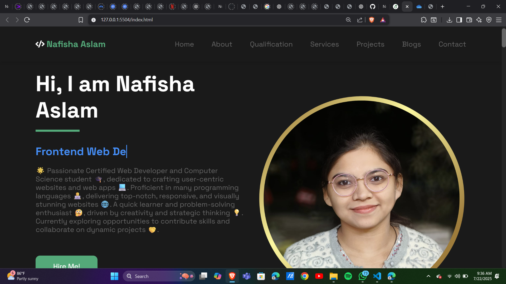

<<<<<<< HEAD
<<<<<<< HEAD
# My_portfolio
=======
# NAFISHA ASLAM Portfolio Website 🌐

Welcome to my portfolio website! This repository contains the source code for my personal website, showcasing my skills, projects, and experiences.

## Table of Contents

- [About Me](#about-me)
- [Technologies Used](#technologies-used)
- [Features](#features)
- [Getting Started](#getting-started)
- [Screenshot](#screenshot)

## About Me

**I'am Nafisha Aslam, a passionate software developer with a background in computer science. I specialize in front-end development, and full-stack projects, Software Engineer. My goal is to create visually appealing and user-friendly websites that enhance the user experience.**

## Technologies Used

- HTML5
- CSS3
- JavaScript

## Features

- Responsive design
- Clean and modern UI/UX
- Smooth animations and transitions
- Interactive elements
- Real-time data fetching (if applicable)
- Cross-browser compatibility
- SEO optimization
- Accessibility considerations

## Getting Started

### Clone the repository: 
`git clone https://github.com/Nafisha08/My-portfolio.git`

## [Portfolio Website Click Here =>💁‍♂️🚀]( https://nafisha08.github.io/My_portfolio/)

## Screenshot:

**Feel free to explore the code and customize it to suit your needs also Like and Give Heart to `[NAFISHA ASLAM](https://github.com/Nafisha08/html-and-css-project-1.git))` ! Happy coding!**
>>>>>>> e60732e (main)
=======
# My_portfolio
>>>>>>> d37a1efa03b75343a6ca7b3cabda01da9d676e24
